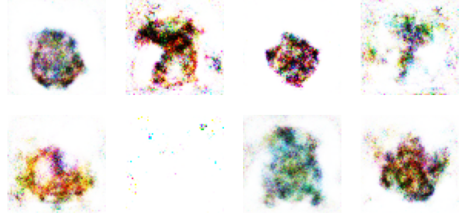
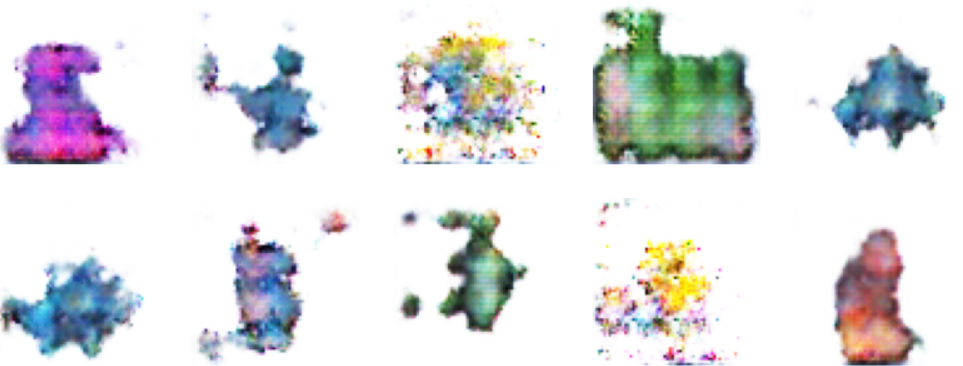

# PokeGAN - Generating Pokemon images

My implementation of various GAN model architectures generating Pokemon images.  
Built fully with PyTorch.  
 Why Pokemon?  
 Because.  

## Project Structure

```ssq
[data]           <- Folder for Pokemon Generations dataset   
  |
  |_____[pokemon.txt]           <- A txt File of Pokemon classes and class info

[images]           <- A folder of images, generated by models
  |
  |_____[markdown_cache]           <- Photoes used in jupyter notebooks and markdown files are stored here.
  |
  |_____[MODEL_NAME]           <- Photoes, generated by GAN Models

[models]           <- Folder of code for all GAN Models
  |
  |_____[MODEL_NAME]           <- A ProGAN Model code + weights
           |
           |_____[config.py]          <- A configuration file (for training)
           |_____[model.py]           <- A file with PyTorch implementation
           |_____[train.py]           <- Training code
           |_____[utils.py]           <- Helper functions (tensorboard, saving, etc.)
           |_____[data.py]            <- Class of a Dataset implementaton
           |
           |_____[logs]               <- Tensorboard logs of model training
           |
           |_____[cached]             <- Model's weights folder

[notebooks]           <- A folder of all Jupyter Notebooks
  |
  |_____[01_data_preprocessing.ipynb]          <- A code for downloading \ formatting data + custom DataClass and DataLoader
  |_____[02_ProGAN.ipynb]          <- A Page on ProGAN and its results

```

### Built using **PyTorch**

## ProGAN Model


My implementation of ProGAN architecture, built with **PyTorch**.  
Generates images based on a *Pokemon Generations Dataset* [kaggle](https://www.kaggle.com/datasets/truthisneverlinear/pokemon-generations-image-dataset)  
Due to my limitations in GPU power, i was able to train it only for small number of epochs (approx. 50 for 32x32 img resolutions, each taking about 1.5hr on my 1060 TI laptop GPU v-v)  
However, it still is the most advanced model in this repository, and, with enough computational resources, you can train it to create good images in up to 1024x1024 px resolution!

## Simpler models

### Simple GAN

A Non-Convolutional NN, consists of two models:  

- Discriminator (Determines if image is real or fake)  
- Generator (Generates images resembling real from a random normal distribution)

This Model is *extremely* simple, and consists of basically Linear Layers, followed by some LeakyReLU layers. I didnt expect it to perform well, as this model architecture was available 20-30 years ago. It manages to generally grasp a distribution, and on 64x64 image resolution it provides a bleak stylized colourful mess, barely resembling a pokemon.



### DCGAN

**DCGAN** Is a GAN architecture that utilized Convolutional layers and resembles a CNN-like structure (*although we do not use Pooling layers or Flatten layers*).
It's generator structure is simple and involves transforming a latent noise vector into a 64x64 image, generated based on noise distribution of latent vector.  
The discriminator (*also called a **critic***) is the reverse of a generator.
DcGAN solves the same loss function, as a simple GAN:  

- The discriminator tries to maximise the distance between a probability of a given image being fake and it being real
- The Generator tries to "fool" the Discriminator and minimise a probability of a Discriminator realizing a given image is fake

